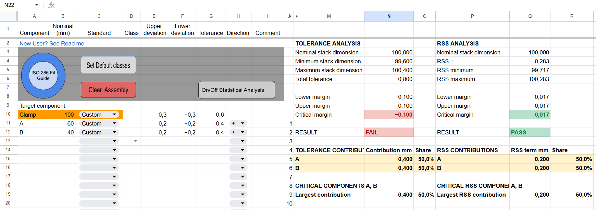
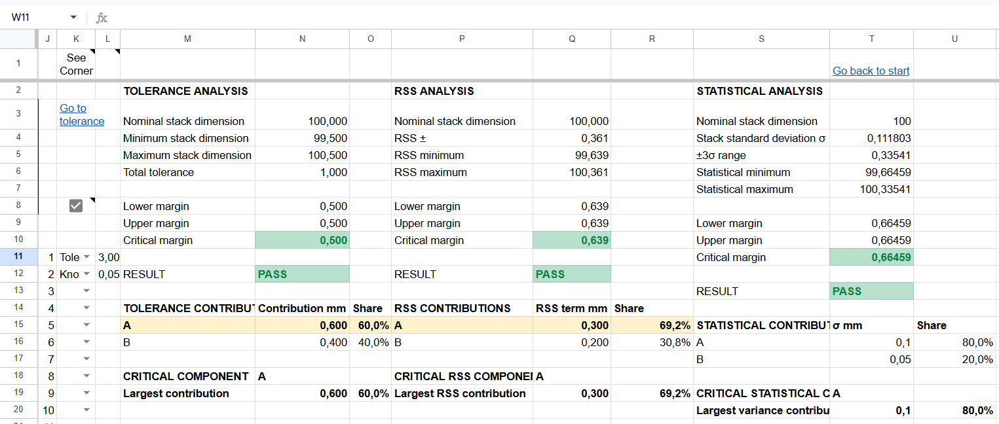
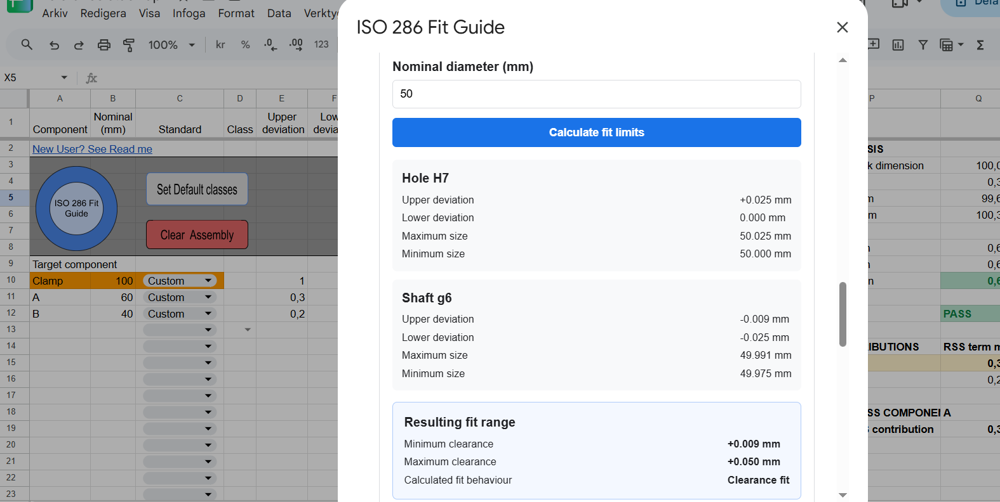
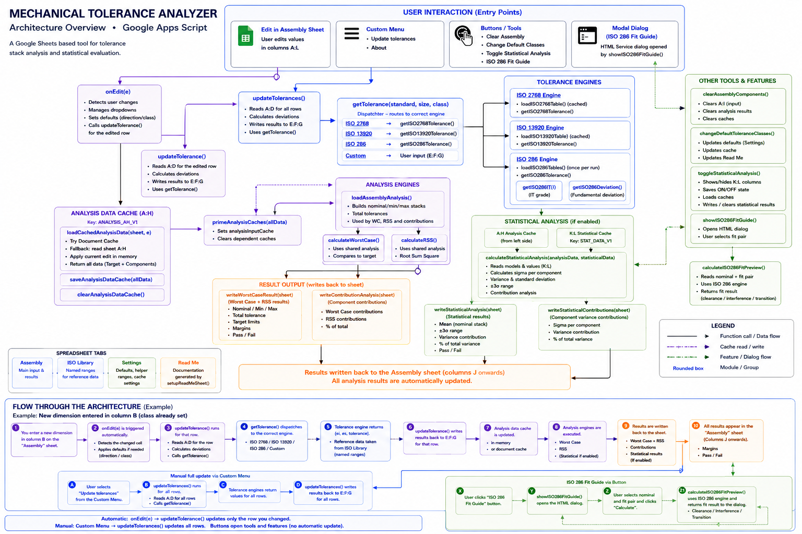

# Mechanical Tolerance Analyzer

A mechanical engineering tolerance stack-up analysis tool built in Google Sheets and Google Apps Script.

The tool was developed to provide a practical and accessible way to evaluate dimensional tolerance chains using Worst Case, Root Sum Square (RSS), and statistical analysis methods.

*Example tolerance stack where the Worst Case analysis fails the target requirement while the RSS analysis passes.*

## Features

- Worst Case tolerance stack-up analysis
- Root Sum Square (RSS) analysis
- Advanced statistical analysis using component standard deviations
- Automatic PASS / FAIL evaluation against a target dimension
- Component contribution analysis
- Identification of critical tolerance contributors
- Positive and negative stack directions
- Symmetric and asymmetric tolerances
- Custom tolerance input
- ISO 2768 tolerance support
- ISO 13920 tolerance support
- ISO 286 tolerance calculations
- ISO 286 hole/shaft Fit Guide
- Configurable default tolerance classes
- Automatic recalculation when component data is edited
- Support for tolerance chains containing up to 20 components

## Analysis Methods

### Worst Case

Worst Case analysis assumes that all component dimensions simultaneously reach the combination of tolerance limits that produces the largest possible variation in the final stack.

This provides a conservative evaluation of the complete tolerance range.

### Root Sum Square (RSS)

RSS combines independent component tolerance contributions statistically rather than adding every contribution at its worst possible limit.

The analyzer also calculates the relative contribution of each component to the total RSS result.

### Statistical Analysis

Optional statistical analysis allows individual components to be defined using either:

- a tolerance-based sigma assumption, or
- a known process standard deviation (σ).

Component variances are combined to calculate the standard deviation of the complete tolerance stack.

The current implementation evaluates the resulting stack using a ±3σ range.

*Comparison of Worst Case, RSS, and ±3σ statistical analysis for the same tolerance stack.*

## ISO 286 Fit Guide

The analyzer includes an integrated ISO 286 Fit Guide for evaluating common
hole and shaft fit combinations.

For a selected nominal diameter and fit pair, the guide calculates:

- Upper and lower deviations for the hole
- Upper and lower deviations for the shaft
- Maximum and minimum sizes
- Minimum and maximum clearance
- Resulting fit behaviour: clearance, transition, or interference fit

*Example evaluation of a 50 mm H7/g6 fit. The calculated clearance range is
+0.009 mm to +0.050 mm, resulting in a clearance fit.*

> **Note:** ISO standard tables and copyrighted reference data are not
> included in this repository. The project demonstrates the calculation
> architecture and user interface; users must provide appropriately licensed
> reference data where required.

## Target Evaluation

The final tolerance stack is compared with a user-defined target dimension and its upper and lower allowable deviations.

The analyzer calculates:

- lower margin
- upper margin
- critical margin
- PASS / FAIL result

Worst Case, RSS, and Statistical Analysis are evaluated independently.

This makes it possible, for example, for a tolerance chain to fail a Worst Case requirement while still passing an RSS evaluation.

## Tolerance Standards

The calculation engine supports:

- ISO 2768
- ISO 13920
- ISO 286
- Custom tolerances

ISO 286 calculations support tolerance classes and upper/lower deviations for hole and shaft tolerance zones.

An integrated ISO 286 Fit Guide can be used to evaluate hole/shaft combinations and classify the resulting fit as:

- Clearance fit
- Transition fit
- Interference fit

## ISO Standard Data

ISO standards are copyrighted publications.

For licensing reasons, the ISO reference tables used by the author's working version of the analyzer are not distributed in this repository.

The source code demonstrates the calculation architecture and how external tolerance reference data is used without redistributing the underlying ISO table content.

Users are responsible for obtaining and using reference data from appropriately licensed sources.

## Engineering Scope

The analyzer is intended for component-level mechanical tolerance stack-up analysis.

A maximum of 20 stack components is used as a deliberate design scope for the current version.

More complex system-level variation studies involving 3D tolerance analysis, geometric tolerances, correlations, or advanced manufacturing variation may require dedicated tolerance-analysis software.

This project is intended as an engineering calculation aid and demonstration
project.

Results should be independently verified before being used for production,
safety-critical, certification, or other critical engineering decisions.

The statistical methods also depend on the assumptions and input data selected
by the user.

## Installation and Setup

Mechanical Tolerance Analyzer is built for Google Sheets and Google Apps Script.

The repository contains the calculation and interface source code, but does not
include copyrighted ISO reference table values.

### 1. Create a Google Sheets workbook

Create a workbook containing the following sheets:

- `Assembly`
- `ISO Library`
- `Settings`
- `Read Me`

The sheet names must match exactly unless the corresponding values in
`Config.gs` are changed.

### 2. Open Google Apps Script

From the Google Sheets workbook:

`Extensions → Apps Script`

Create the required `.gs` files and copy the source code from the `src/`
directory.

The file structure inside Apps Script does not have to match the GitHub
directory structure exactly. All `.gs` files in an Apps Script project share
the same global script environment.

### 3. Add the ISO 286 Fit Guide

Create an HTML file in Apps Script named:

`ISO286FitGuide`

Copy the contents of:

`html/ISO286FitGuide.html`

into that file.

The Fit Guide communicates with the Apps Script backend through
`calculateISO286FitPreview()`.

### 4. Provide reference data

ISO reference table values are not distributed with this repository.

Users who have access to appropriately licensed reference data can enter the
required values in the `ISO Library` sheet.

The calculation engines access these tables through Google Sheets named ranges.
The named ranges must use the structures described below.

The physical position of the tables inside the `ISO Library` sheet is not
important. The named ranges are the interface between the spreadsheet data and
the calculation code.

### 5. Run workbook setup functions

The following setup functions configure spreadsheet validation, formatting,
helper ranges and documentation:

- `setupTargetClassDropdown()`
- `setupAnalysisFormatting()`
- `setupToleranceContributionFormatting()`
- `setupRSSContributionFormatting()`
- `setupStatisticalColumns()`
- `setupStatisticalAnalysisToggle()`
- `setupReadMeSheet()`

These functions normally only need to be run when initially creating or
rebuilding the workbook.

After setup, reload the spreadsheet so the custom
`Mechanical Tolerance Analyzer` menu is created.

## Required Named Ranges

The analyzer separates calculation logic from reference data.

The ISO reference values are supplied by the user and connected to the
calculation engines through the following named ranges.

### ISO 2768

Named range:

`tblISO2768`

Expected structure:

| Column | Content |
|---|---|
| A | Maximum nominal size |
| B | Class f |
| C | Class m |
| D | Class c |
| E | Class v |

Example header layout:

`Max mm | f | m | c | v`

The first row of the named range contains the headers.

Each following row defines the upper limit of a nominal-size interval and the
corresponding tolerance value for each available class.

Blank cells may be used where a tolerance class is not applicable for a
particular size range.

### ISO 13920

Named range:

`tblISO13920`

Expected structure:

| Column | Content |
|---|---|
| A | Maximum nominal size |
| B | Class A |
| C | Class B |
| D | Class C |
| E | Class D |

Example header layout:

`Max mm | A | B | C | D`

The first row of the named range contains the headers.

Each following row defines the upper limit of a nominal-size interval and the
corresponding tolerance value for each class.

### ISO 286 — IT Grades

Named range:

`tblISO286_IT`

Expected structure:

| Column | Content |
|---|---|
| A | Minimum nominal size |
| B | Maximum nominal size |
| C onward | IT grade values |

Example header layout:

`Min mm | Max mm | IT5 | IT6 | IT7 | IT8 | ...`

The first row of the named range must contain the column headers.

The calculation engine identifies the IT columns from headers in the form:

`IT5`, `IT6`, `IT7`, `IT8`, etc.

The table values are expected in µm.

Diameter intervals are evaluated as:

`size > minimum && size <= maximum`

For example, a row containing:

`30 | 50 | ...`

is used for nominal sizes greater than 30 mm and up to and including 50 mm.

Descriptive text placed above the table in the worksheet, such as a table
title, should not be included in the named range.

### ISO 286 — Fundamental Deviations

Named range:

`tblISO286_DEV`

Expected structure:

| Column | Content |
|---|---|
| A | Minimum nominal size |
| B | Maximum nominal size |
| C | Tolerance-zone letter |
| D | Optional IT grade |
| E | Fundamental deviation type |
| F | Fundamental deviation value |

Example header layout:

`Min mm | Max mm | Letter | IT | Deviation | Value µm`

The first row of the named range contains the headers.

The fundamental deviation type in column E must be:

- `EI` for a lower deviation, or
- `ES` for an upper deviation.

Column D may contain a specific IT grade where the fundamental deviation
depends on the grade. It may otherwise be left blank.

Fundamental deviation values in column F are expected in µm.

The calculation engine combines the fundamental deviation with the selected
IT-grade tolerance width to determine the complete ISO 286 tolerance zone.

For an `EI` entry:

`EI = fundamental deviation`

`ES = EI + IT tolerance`

For an `ES` entry:

`ES = fundamental deviation`

`EI = ES - IT tolerance`

The final upper and lower deviations returned by the analyzer are converted
from µm to mm.

As with the IT table, worksheet titles or source notes placed outside the
actual data table should not be included in the named range.

### Named Range Summary

The required named ranges are:

| Named range | Purpose |
|---|---|
| `tblISO2768` | ISO 2768 general tolerance reference data |
| `tblISO13920` | ISO 13920 tolerance reference data |
| `tblISO286_IT` | ISO 286 IT-grade tolerance widths |
| `tblISO286_DEV` | ISO 286 fundamental deviations |

The named ranges may be located anywhere in the `ISO Library` sheet as long as
their internal column structure matches the formats above.

> **Reference data notice:** ISO standard table values are intentionally not
> included in this repository. Users must obtain and use reference data from
> appropriately licensed sources.

## Spreadsheet Buttons

The Google Sheets user interface may use drawings or images as buttons.

Google Sheets buttons are workbook objects and are therefore not included in
this source-code repository.

Create the buttons manually and assign the following Apps Script functions:

| Button | Assigned script |
|---|---|
| Clear Assembly | `clearAssemblyComponents` |
| Set Default Classes | `changeDefaultToleranceClasses` |
| Statistical Analysis On / Off | `toggleStatisticalAnalysis` |
| ISO 286 Fit Guide | `showISO286FitGuide` |

To assign a function in Google Sheets:

1. Insert or select a drawing/image.
2. Open its options menu.
3. Select **Assign script**.
4. Enter the function name without parentheses.

Example:

`clearAssemblyComponents`

not:

`clearAssemblyComponents()`

## Technology

The project is implemented using:

- Google Sheets
- Google Apps Script
- JavaScript
- HTML/CSS for the ISO 286 Fit Guide
- Google Apps Script Cache Service for performance optimization

The spreadsheet provides the user interface while Apps Script handles tolerance calculations, input validation, automatic updates, analysis, caching, and result presentation.

## Verification

The calculation engine has been manually verified using controlled test cases covering:

- additive tolerance chains
- subtractive tolerance chains
- mixed positive and negative stack directions
- symmetric tolerances
- asymmetric tolerances
- Worst Case analysis
- RSS analysis
- Worst Case FAIL / RSS PASS scenarios
- statistical tolerance-basis calculations
- known process σ values
- component contribution calculations
- PASS / FAIL margin evaluation

Detailed verification cases are documented in [`TEST_CASES.md`](TEST_CASES.md).

## Architecture

The diagram below shows the main function calls, data flow, tolerance engines,
analysis engines, caching, statistical analysis, and spreadsheet integration.

The source code is separated into functional modules for maintainability,
while Google Apps Script executes the `.gs` files within the same global
script environment.

## Version

**Version 1.0**

Initial public portfolio version of the Mechanical Tolerance Analyzer.

## Author

Developed by **Henrik Thorwaldsson**

Mechanical engineer with an interest in mechanical design, tolerance analysis,
engineering automation, and practical engineering tools.
